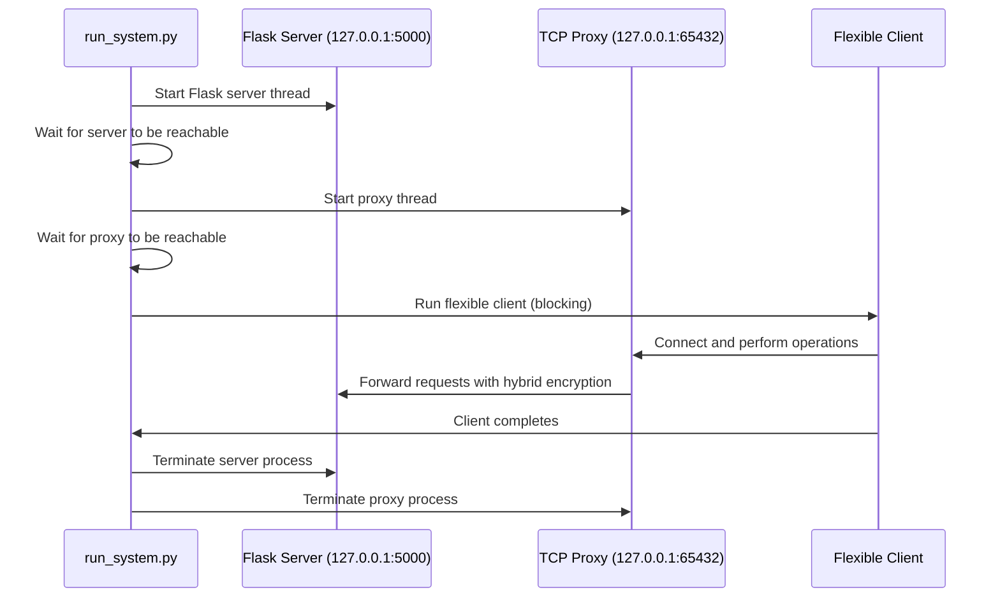

# Hybrid Classical PQC (Post-Quantum Cryptography)

This project implements a hybrid classical and post-quantum cryptography system, providing a secure communication layer between clients, proxies, and servers.

## Project Structure

- **server/**: Flask-based backend server handling authentication and data management
- **proxy/**: TCP proxy implementing hybrid PQC/RSA encryption for secure tunneling
- **client/**: Client implementations for connecting to the proxy and server
- **run_system.py**: Integration script for running a complete system simulation

## Simulation Flow

The `run_system.py` script orchestrates a complete end-to-end simulation of the hybrid PQC system:

### Flow Description

1. **Cleanup Phase**: The script first kills any existing processes listening on the required ports (5000, 5005, 7000, 65432) to ensure clean startup.

2. **Server Startup**: Launches the Flask server in a daemon thread using `flask run --host 127.0.0.1 --port 5000`. The server runs from the `server/` directory with its own virtual environment if available.

3. **Proxy Startup**: Starts the TCP proxy in a separate daemon thread by executing `proxy.py` from the `proxy/` directory. The proxy listens on `127.0.0.1:65432`.

4. **Service Verification**: The script waits for both services to become reachable by attempting TCP connections with retries (up to 40 attempts with 0.5-second delays).

5. **Client Execution**: Runs the flexible client (`client/flexible_client.py`) directly, allowing it to perform secure operations through the proxy to the server. This operation is blocking and runs in the main thread.

6. **Encryption Flow**: All communication between the client and server flows through the proxy, which applies hybrid classical/PQC encryption. The client connects to the proxy, which then forwards requests to the server using secure cryptographic primitives.

7. **Cleanup**: Once the client completes its operations, the script terminates both the proxy and server processes, terminating them gracefully first (with a 5-second timeout) and killing them forcefully if necessary.

This simulation demonstrates the complete lifecycle of secure client-server communication using hybrid post-quantum cryptography, where the proxy acts as a secure intermediary handling encryption/decryption between the classical client and the PQC-enabled server infrastructure.

