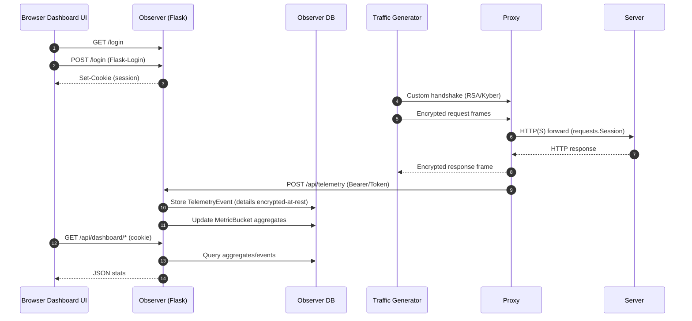
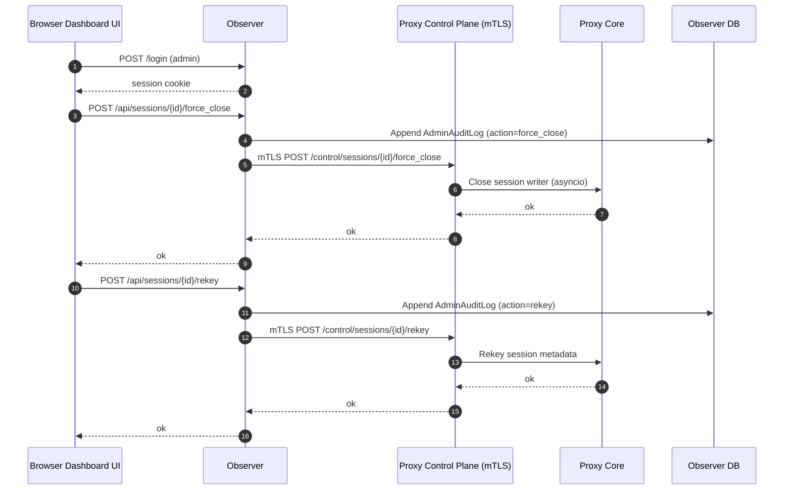

# Hybrid Classical + PQC Proxy System

## 1) Architecture Diagram

```mermaid
flowchart LR
  subgraph ClientSide[Client Side]
    UI[Dashboard UI<br/>HTTPS + Session Cookies + RBAC]
    TG[Traffic Generator<br/>Flexible_Client.py]
  end

  subgraph ObserverLayer[Observer / Proxy API Layer]
    OBS[Observer (Flask :5600)<br/>Flask-Login + RBAC]
    DB[(Observer DB<br/>TelemetryEvent + MetricBucket + Audit + AlertRule)]
  end

  subgraph ProxyLayer[Proxy Core / Traffic Forwarder]
    PROXY[Proxy (asyncio)
    Custom protocol terminator
    HTTP(S) forwarder]
    CTRL[Proxy Control Plane<br/>mTLS HTTPS :7443]
  end

  subgraph ServerLayer[Application Server]
    SRV[Server (Flask :5000)]
  end

  UI -->|Same-origin requests
session cookie| OBS
  OBS --> DB

  TG -->|custom encrypted protocol| PROXY
  PROXY -->|HTTP(S) requests| SRV

  PROXY -->|secure telemetry
(token-auth POST /api/telemetry)| OBS

  OBS -->|admin actions
mTLS control| CTRL
```

## 2) Dataflow Diagram



## 3) Control Flow Diagram (Admin control plane)



## Notes (standards alignment)

- **NIST SP 800-53 (AC/AU/SI/SC)**
  - RBAC + least privilege for sensitive endpoints.
  - Audit logging for privileged actions.
  - Monitoring + alerting (threshold + predictive).
- **NIST SP 800-52**
  - HTTPS support for Observer, mTLS for proxy control plane.
- **ISO 27001/27002**
  - A.9 access control (RBAC), A.10 crypto (TLS, encryption-at-rest), A.12 logging/monitoring.

